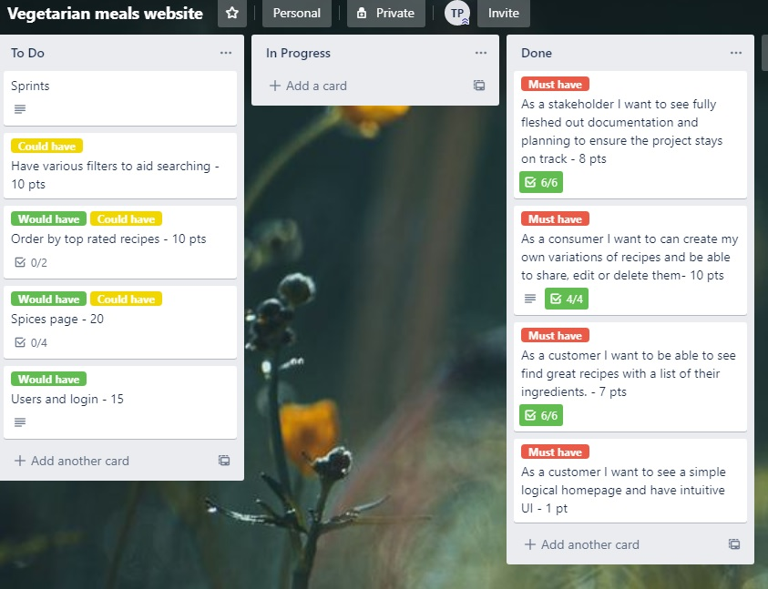
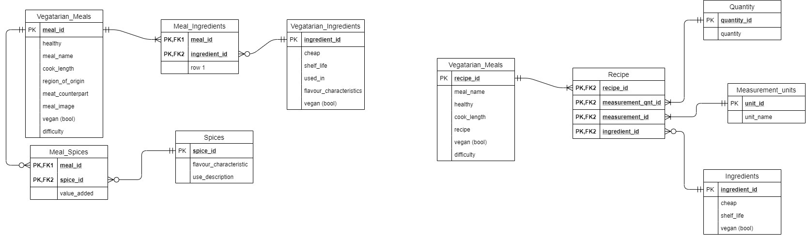
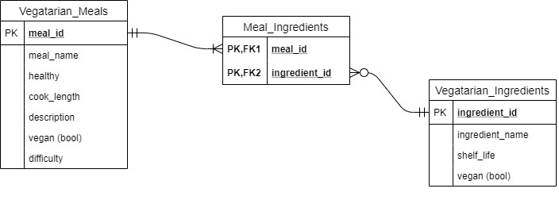
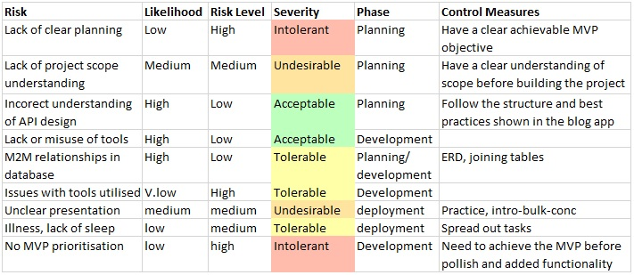
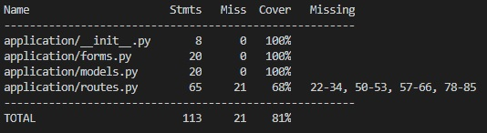
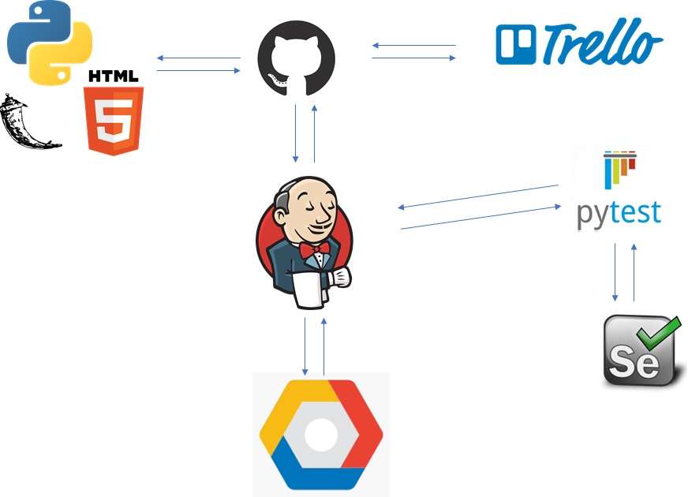

# QAC Fundamental Project

## Vegetarian recipes using flask

### Table of contents
1. Introduction
1. Project Scope
1. Technology constraints
1. Entity Relationship Diagrams
1. Risk Assessment
1. Deployment
1. Testing

### Introduction
The purpose of this project was to create a 'CRUD' application whilst utilising the tools, methodologies and technologies that were taught in the modules so far in this DevOps course.

### Breif
Create functional website following best practices with full crud functionality featuring a relational database and utilising a version control system (git). The project must have clear documentation and follow agile principles. This includes a project tracking board identifing user stories, tasks and progression. 

### Soloution
I decided to create a website that allows uses to share there favourite vegatarian meals. This featured a relational database between meals and ingredients. Within the meals database are multiple columns that are great for sorting meals and if I were to develop this further I would add a search bar that sorted the meals displayed based them on various queries.

### Trello board

Each card reperesents a user story and is assigned a story points value. Each card is then split into tasks using a checklist.

### Arcitecture

At the start of the project the intial idea was to be able to create proper recipes using a database of ingredients and so I designed the ERD on the left. Midway through the project after doing some research I realized the proper way to implement the ingredients in a way that could be used in a recipe (shown on the left) would be hard to implement and wouldn't even lead to a project that anyone would want to use. So I changed the purpose from creating recipes to sharing meals. This was not only easier but down the line using filters I could see it being useful.

This shares similarities with the original ERD but is simplfied further

### Risk Assessment

### Bugs 
A bug in creating an empty testing database due to a query I have in one of my forms. The query uses the ingredients database to display the ingredients allowing the user to select ingredients to add to a meal. The bug occurs during testing intialization when the database is empty the query throws an error and prevents testing many of the features to do with the ingredients database. Multiple fixes have been trialed such as blocking entry to the query using an if statement but a convinent fix has yet to be found. 

Duplicate entries for both the meals and ingredients remains unhandeled

### Testing

Test coverage for the backend is at 81% and appears to be capped at this percentage due to the bug. 

### Deployment

Integration testing with selenium was removed from the MVP and due to the database error still being present I ended up not implementing it for this project.

### Improvements for the future
During this project I had a tendency to work in phases. For the planning phase this was fine. But during development I foucused soley on developing the app and its functionality and then moved onto testing and then onto jenkins. This workflow was mainly because I was learning how to do each step as I went along so it made sense to focus on things one tool at a time. However this goes against the devops TDD and continous intergration approach. So in future projects I would aim to build, test and deploy throughout. 

If I were to develop this app further I would like to:
1. Fix the database error and implement intergration testing.
1. Implement a simple filter to make finding meals based on preference even easier. 
1. Implement a Users database allowing me to control access to various features. The users may also allow me to implement an upvote system allowing top rated meals to be displayed at the top or on the home page. 
1. I would also consider adding a spices database for greater customization of meals. 

### Authors
#### By Tom Petty
