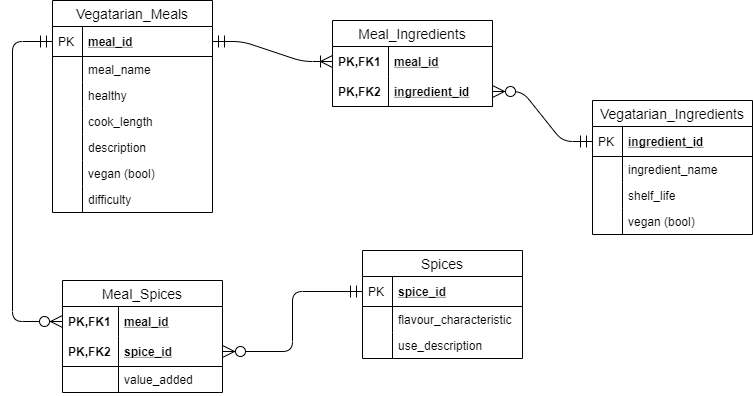

# QAC Fundamental Project

## Vegetarian recipes using flask

### Table of contents
1. Introduction
1. Project Scope
1. Technology constraints
1. Entity Relationship Diagrams
1. Risk Assessment
1. Deployment
1. Testing

### Introduction
The purpose of this project was to create a 'CRUD' application whilst utilising the tools, methodologies and technologies that were taught in the modules so far in this DevOps course.

### Breif
Create functional website following best practices with full crud functionality featuring a relational database and utilising a version control system (git). The project must have clear documentation and follow agile principles. This includes a project tracking board identifing user stories, tasks and progression. 

### Soloution
I decided to create a website that allows uses to share there favourite vegatarian meals. This featured a relational database between meals and ingredients. Within the meals database are multiple columns that are great for sorting meals and if I were to develop this further I would add a search bar that sorted the meals displayed based them on various queries.

### Trello board

### Arcitecture

The ingredients meal_ingredients and meals tables where all implemented but due to time constraints the spices table was never impemented.

### Risk Assessment

### Bugs 
A bug in creating an empty testing database due to a query I have in one of my forms. The query uses the ingredients database to display the ingredients allowing the user to select ingredients to add to a meal. The bug occurs during testing intialization when the database is empty the query throws an error and prevents testing many of the features to do with the ingredients database. Multiple fixes have been trialed such as blocking entry to the query using an if statement but a convinent fix has yet to be found. 

Duplicate entries for both the meals and ingredients remains unhandeled

### Testing
Test coverage for the backend is at 81% (21 lines missed in routes) capped at this percentage due to the bug. 

### Deployment

Integration testing with selenium was removed from the MVP and due to the database error still being present I ended up not implementing it for this project.

### Improvements for the future

### Authors
#### By Tom Petty
